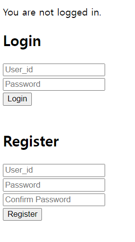
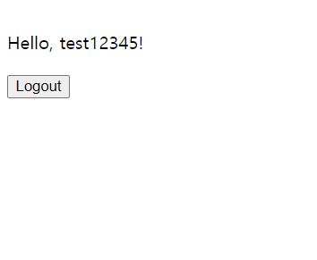

# screen
* not logged in 

* logged in

# Registration

* Password validation
    * length>8
    * not including other language except alphanumeric characters
    * Need at least 1 Capital letter of english.
    * Need at least 1 number.
    * Need at lest 1 special character  !@#\^&*,.?

* Check if user already exist or not

* Check if the password == cofrim password value is same or not. and if it is unmatched, show 'Passwords do not match.';

# Logout

* sessions being destroyed

# Login

* if login failed, show "Login failed"
* if login successful, wait 4 secs and redirect to homepage, showing the logged in screen.

# Database
## users
| Field  | Data Type | Constrainsts  | Default Value | Special Attributes|
| ------------- | ------------- | ------------- | ------------- | ------------- |
| id  | int  |  PRIMARY KEY | | AUTO_INCREMENT |
| user_id  |  VARCHAR(10)  | NOT NULL, UNIQUE|
| password  | VARCHAR(255)  | NOT NULL |
| password_salt  | VARCHAR(64)  | NOT NULL |
| create_at | TIMESTAMPE |  |DEAFULT CURRENT_TIMESTAMP

## sessions
| Field  | Data Type | Constrainsts  | Default Value | Special Attributes|
| ------------- | ------------- | ------------- | ------------- | ------------- |
| id  | int  |  PRIMARY KEY | | AUTO_INCREMENT |
| user_id  |  int | NOT NULL, FOREIGN KEY REFERENCES users(id) ON DELETE CASCADE| NOT NULL| 
| session_id  | VARCHAR(255)  | NOT NULL |
| create_at | TIMESTAMPE |  |CURRENT_TIMESTAMP

## error_log

* /reigster, /login 404 page error
-> sloved by the .htaccess issue 

* for Yaml impelmentation
-> installed php composer on xampp (window version)
-> install symfony/yaml using composer `composer require symfony/yaml`  
    * Package manager - composer / symfony - framework

>Fatal error: Uncaught TypeError: Cannot access offset of type string on string in C:\xampp\htdocs\public\app\models\database.php:14 Stack trace: #0 C:\xampp\htdocs\public\app\models\users.php(9): Database->__construct() #1 C:\xampp\htdocs\public\app\controllers\auth.php(9): User->__construct() #2 C:\xampp\htdocs\public\index.php(17): AuthController->__construct() #3 {main} thrown in C:\xampp\htdocs\public\app\models\database.php on line 14

* /register /login page database.php runs endlessly.
->  dont need to set $this in itself class.
>    public function __construct() {
>        $this->db = new Database();
>        //⇓ Wrong code. no need to add instace for User(running the code endlessly) 
>        // $this->userModel = new User();
>    }